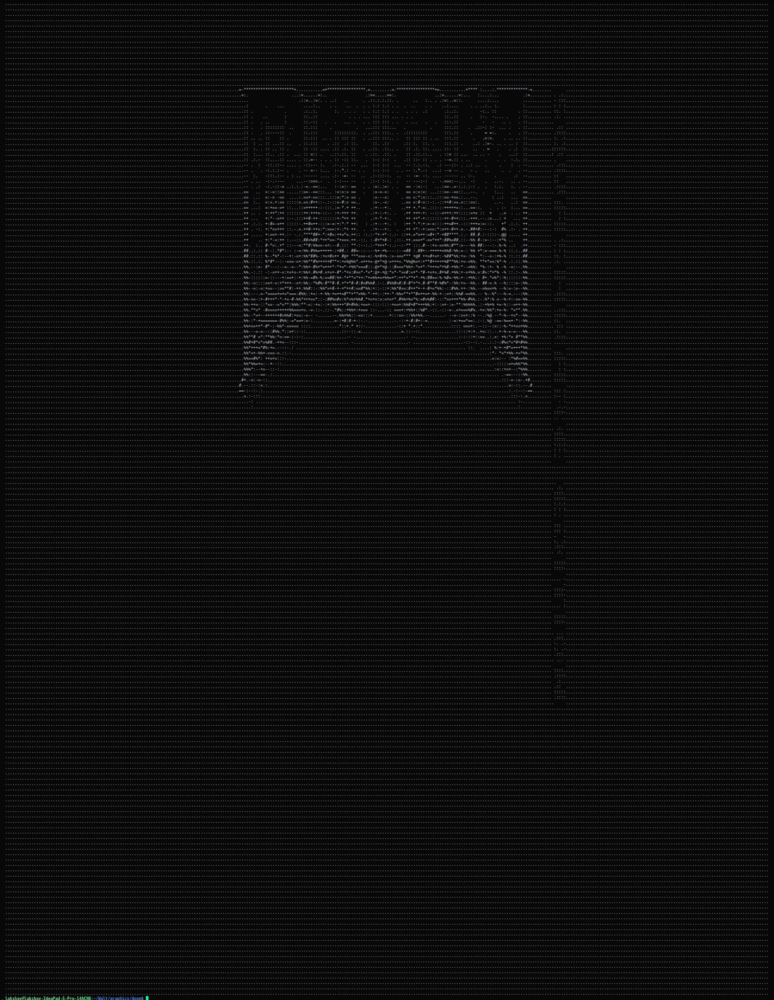
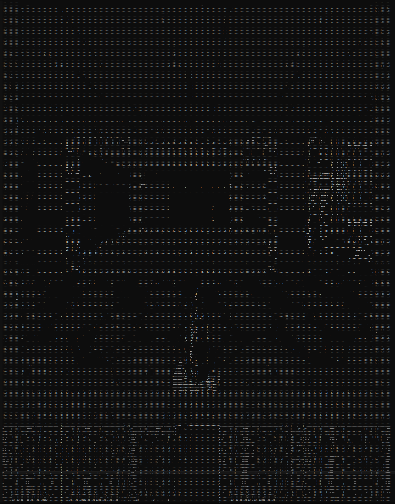
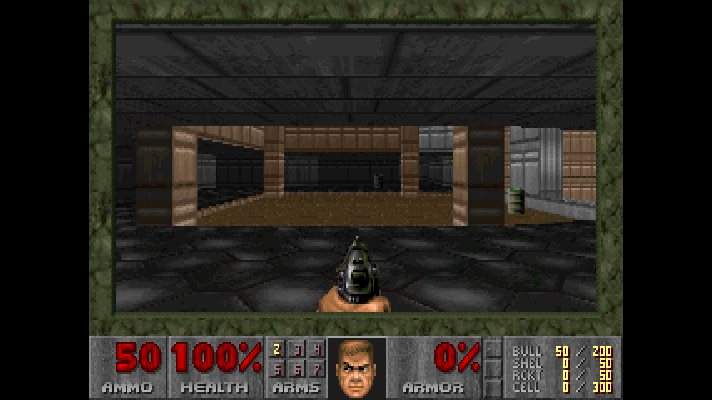

<!-- PROJECT LOGO --> <br /> <p align="center"> <a href="https://github.com/Talkative-Banana/Constexpr-Doom">  </a>

<!-- ABOUT THE PROJECT -->

# Constexpr-Doom

A wasm interpreter in c++ constexpr evaluation to run doom in compile time. The interpreter supports both compile and runtime time execution of game. A stripped down version of wad was used to keep the memory consumption as low as possible, although compile time execution still requires close to 400GB of memory, which was alloted by allocating swapspace, imagine having 400GBs of RAM! ;).

<!-- BUILT WITH -->
## Built With
* C++ 20
* g++12 / clang
* Python


<!-- TABLE OF CONTENTS -->
## Table of Contents
## Table of Contents
<details open="open">
  <summary>Table of Contents</summary>
  <ol>
    <li>
      <a href="#about-the-project">About The Project</a>
      <ul>
        <li><a href="#built-with">Built With</a></li>
      </ul>
    </li>
    <li>
      <a href="#preview">Preview</a>
      <ul>
        <li><a href="#home-screen">Home Screen</a></li>
        <li><a href="#in-game-preview">In Game Preview</a></li>
        <li><a href="#doom-preview">Doom Preview</a></li>
      </ul>
    </li>
    <li>
      <a href="#getting-started">Getting Started</a>
      <ul>
        <li><a href="#prerequisites">Prerequisites</a></li>
        <li><a href="#installation">Installation</a></li>
      </ul>
    </li>
    <li>
      <a href="#documentation">Documentation</a>
      <ul>
        <li><a href="#directory-layout">Directory Layout</a></li>
        <li><a href="#build-pipeline">Build Pipeline</a></li>
        <li><a href="#key-components">Key Components</a></li>
        <li>
          <a href="#running">Running</a>
          <ul>
            <li><a href="#runtime-mode-fast-for-development">Runtime Mode</a></li>
            <li><a href="#constexpr-mode-compile-time-doom-cool-part-but-takes-significantly-longer">Constexpr Mode</a></li>
            <li><a href="#regenerating-parsedstatehpp">Regenerating parsedState.hpp</a></li>
          </ul>
        </li>
        <li><a href="#how-it-works">How It Works</a></li>
      </ul>
    </li>
    <li><a href="#known-issue">Known Issue</a></li>
    <li><a href="#contributing">Contributing</a></li>
    <li><a href="#contact">Contact</a></li>
    <li><a href="#acknowledgements">Acknowledgements</a></li>
    <li><a href="#license">License</a></li>
  </ol>
</details>


<!-- PREVIEW -->
## Preview

### Home Screen

<br /> <p align="center"> <a href="https://github.com/Talkative-Banana/Constexpr-Doom">  </a>

## In Game Preview

<br /> <p align="center"> <a href="https://github.com/Talkative-Banana/Constexpr-Doom">  </a>

## Doom Preview

<br /> <p align="center"> <a href="https://github.com/Talkative-Banana/Constexpr-Doom">  </a>
<!-- GETTING STARTED -->
## Getting Started

The repo contains multiple helper python files which provide essential support in the setup of state for the program, visualisation, and parsing of the generated wasm source code.

<!-- PREREQUISITES -->
### Prerequisites

Install these dependecies to covert c/cpp code to wasm and from wasm to wat (Wat is just a human readable form of wasm binary), along with that close to 400GBs of memory will be required to contain the huge AST and state created by g++/clang, I found gcc conservative in the memory usage while clang tends to allocate alot of ram upfornt. (Swap space will work and that's what I allocated, but it will be a magnitude slower, I got 50 frames rendered in 5 hours so 10fph.)

- wabt
- clang
- lld
- python
- g++


<!-- INSTALLATION -->
### Installation

```sh
# compiler
sudo apt install g++-12

# wasm2wat is part of wabt (WebAssembly Binary Toolkit)
sudo apt install wabt

# clang with wasm32 target
sudo apt install clang lld

# verify
clang --version
wasm2wat --version

```

<!-- DOCUMENTATION -->
## Documentation

<!-- DIRECTORY-LAYOUT -->
### Directory Layout
 
```
Constexpr-Doom/
├── preview/                 # Preview assets (rendered output images)
├── test/                    # Minimal WASM test programs
│
├── .gitignore
├── LICENSE                  # GPL-2.0
├── Makefile                 # Build system — supports RUNTIME_MODE and constexpr mode
├── README.md
│
├── constants.hpp            # Shared constants (MEMORYSIZE, STACKSIZE, MAXFUNCTIONS, …)
├── display.py               # Renders the ASCII frame buffer output to terminal
├── dump.txt                 # Debug dump of interpreter state
├── frame.txt                # Captured ASCII art frame output
│
├── handler.hpp              # WASM opcode dispatch (HandleI, HandleF, HandleCall, …)
├── implementation.hpp       # Doom platform layer stubs (I_FinishUpdate, I_StartTic, …)
├── inspect.hpp              # Compile-time string_view → template char pack trick
├── main.cpp                 # Entry point — constexpr or runtime mode via #ifdef
├── parser.hpp               # WAT text parser (parses functions, globals, data segments)
├── parsedState.hpp          # cpp state code responsible for setting up state create by runtimeParser.py
├── runner.hpp               # Constexpr interpreter loop + RunNoCheck()
├── runtimeParser.py         # WAT → parsedState.hpp emitter (generates make_state())
├── run.sh                   # Shell script to build and run in runtime mode
│
├── state.hpp                # All interpreter state structs (Stack, Memory, Function, …)
├── syscall.hpp              # C stdlib stubs (malloc, memcpy, printf, realloc, …)
└── types.hpp                # Shared types (OP, Member, ParamType, STATUS, …)
```
 
---

<!-- BUILD-PIPELINE -->
### Build Pipeline
 
```
test.wbat
    │
runtimeParser.py ──────────────────▶ parsedState.hpp
                                           │
test.cpp ──clang wasm32──▶ test.wasm       │
              │                            │
           wasm2wat                        │
              │                            │
          test.wbat                        │
              │                            ▼
          (program)              g++ -std=c++20 -O2
                                           │
                          ┌────────────────┴────────────────┐
                          │                                 │
                    RUNTIME_MODE                      constexpr mode
                          │                                 │
                    ./ctwr (fast)              compile-time evaluation
                          │                                 │
                    frame.txt                        inspect<SV>()
```
 
---

<!-- KEY-COMPONENETS -->
### Key Components
 
| File | Purpose |
|------|---------|
| `runtimeParser.py` | Parses WAT and emits `make_state()` and then initialises the full Doom interpreter state at compile time including WAD bytes, function table, memory, and virtual table |
| `parsedState.hpp` | This file is Auto-generated and contains the 524 KB WAD array and complete state initialisation (its a stripped down version of doom) |
| `runner.hpp` | Main interpreter loop which executes WASM opcodes either at compile time (`constexpr`) or runtime |
| `handler.hpp` | Handles every WASM opcode: arithmetic, memory, branches, calls, locals, globals |
| `syscall.hpp` | C standard library syscall stubs like malloc, realloc, memcpy, printf, open, read, … |
| `implementation.hpp` | Doom platform layer like `I_FinishUpdate` renders the ASCII frame, `I_StartTic` injects key events |
| `state.hpp` | All interpreter state: `Stack`, `Memory`, `Function`, `FrameBuffer`, `FileSystem`, … |
| `types.hpp` | Enums and shared types: `OP`, `Member`, `ParamType`, `STATUS`, `Data` |
| `inspect.hpp` | Exposes the compile-time result via `ShowChars<>` template trick |
| `constants.hpp` | Single source of truth for buffer sizes shared between C++ and Python |
 
---

<!-- RUNNING -->
## Running

<!-- RUNTIME-MODE -->
### Runtime Mode (fast, for development)
 
```bash
make RUNTIME_MODE=1
./ctwr
```

 <!-- CONSTEXPR-MODE --> 
### Constexpr Mode (compile-time Doom cool part! but takes significantly longer)
 
```bash
chmod +x run.sh
./run.sh
```
 
> **Note:** Constexpr mode requires significant compiler resources. GCC with `-fconstexpr-ops-limit` set high enough. (You can kill the make process once output is dumped to dump.txt it may take compiler to free all of the allocated space)
 
### Regenerating parsedState.hpp
 
Earlier I had used `parser.hpp` to set up the `state` for doom/program at the compile time as well, but since doom source code is so large I switched to `runtimeParser.py` to output generated `state` and just load it at compile-time

```bash
python3 runtimeParser.py test/test.wbat parsedState.hpp
```
 
---

 <!-- HOW-IT-WORKS? --> 
## How It Works ?
 
1. **Doom is compiled to WASM** using `clang --target=wasm32`
2. **The WAT text format** is parsed by `runtimeParser.py` which emits a C++ `make_state()` function
3. **`make_state()`** initialises the full interpreter state: function table, memory, WAD data, virtual table
4. **The interpreter loop** in `runner.hpp` dispatches WASM opcodes via `handler.hpp`
5. **Platform calls** (`I_FinishUpdate`, `I_GetTime`, etc.) are stubbed in `implementation.hpp`
6. **System calls** (`malloc`, `open`, `printf`, etc.) are stubbed in `syscall.hpp`
6. **After N frames (defined in constants.hpp)**, `I_FinishUpdate` converts the palette-indexed screen buffer to ASCII art and returns `STATUS::ISBAD` to halt execution
7. **In constexpr mode**, the ASCII frame is available as a `string_view` at compile time via `inspect<SV>()` (I used the compiler template initialisation technique to get the output frame, take a look in inspect.hpp, its very cool ;P)
8. To pass in input I have hardcoded `Enter` Key press in `I_STARTTIC` which presses and release enter every frame to get past menu, skill selection and level selction.

---
<!-- KNOWN-ISSUE --> 
## Known Issue

One issue that I am sure you saw is the status bar rendered incorrectly, and you are right, I have been facing this issue lately but not sure whats the root cause is, as I found debugging the program really hard, I have some info why it is happening but not sure what is the root cause,

Here is an overview of what the issue is, during status bar rendering multiple calls to `V_CopyRect` are made, and there are certain checks that each patch needs to satify which this function verifies and calls `I_Error` with (`"Bad V_CopyRect"`) and one of these call fails.

```c
if (srcx < 0
    || srcx + width > SCREENWIDTH
    || srcy < 0
    || srcy + height > SCREENHEIGHT
    || destx < 0
    || destx + width > SCREENWIDTH
    || desty < 0
    || desty + height > SCREENHEIGHT  ← this check fails with desty 191 and height 16 > 200 (SCREENHEIGHT)
    || (unsigned)srcscrn > 4
    || (unsigned)destscrn > 4)

```

To get to render first frame I have manually removed this specific condition in if clause by updating the generated `test.wbat` manually, if you know what is causing the issue please let me know, I have already ran the wad file I use with chocolate-doom and it renders properly, so my wad is not corrupted I believe (see the ss above), and since constexpr evaluation cannot have undefined behaviour - I assume I dont have some ub in my interpreter execution.

> **Fun Fact** Some of the errors I caught were because constexpr refused to compile with UB ;) Look at this `f4578be556975b81a236afd8d2779e83f3e4e2ac` commit if interested there were some signed overflows errors (which are ub).

```wasm
V_CopyRect
...
...
i32.add
local.tee 9
i32.const 217 <- was 201
i32.lt_s
br_if 1 (;@1;)
```

<!-- CONTACT -->
## Contact
Email ID - lakshay21059@iiitd.ac.in

<!-- ACKNOWLEDGEMENTS -->
## Acknowledgements

- Thanks to [Dimitri](https://github.com/dimitropoulos) from [Michigan TypeScript](https://www.youtube.com/@MichiganTypeScript) that made me believe something like this was remotely possible! Checkout the TypeScript Doom here it's way cooler and more complex [here](https://www.youtube.com/watch?v=0mCsluv5FXA).

- [Jason Turner](https://www.youtube.com/@cppweekly) for awesome cpp talks and especially [Constexpr All The Things!](https://www.youtube.com/watch?v=PJwd4JLYJJY&t=1802s&pp=ygUYY29uc3RleHByIGFsbCB0aGUgdGhpbmdz).

- And my comrades of [Ninth-Circle](https://github.com/ninth-circle)

<!-- LICENSE --> 
## License
 
GPL-2.0 — see [LICENSE](LICENSE)
